P8108 Survival Analysis Heart Failure
================
Yi Huang
2023-11-10

## Preparation, install and read packages, read functions

``` r
#----------------------------------------------------------------
# CLEAR ENVIRONMENT
#----------------------------------------------------------------
rm(list = ls())

#----------------------------------------------------------------
# INSTALL PACKAGES
#----------------------------------------------------------------
packages <- c("dplyr", "tidyverse", "readxl", 
              "survival", "KMsurv", 
              # ggsurvplot()
              "survminer",
              # stepwiseCox()
              "StepReg")


# Install missing packages
installed_packages <- packages %in% rownames(installed.packages())
if (any(installed_packages == FALSE)) {
  install.packages(packages[!installed_packages], dependencies = TRUE)
}

# Load packages invisibly
invisible(lapply(packages, library, character.only = TRUE))
```

    ## 
    ## Attaching package: 'dplyr'

    ## The following objects are masked from 'package:stats':
    ## 
    ##     filter, lag

    ## The following objects are masked from 'package:base':
    ## 
    ##     intersect, setdiff, setequal, union

    ## ── Attaching core tidyverse packages ──────────────────────── tidyverse 2.0.0 ──
    ## ✔ forcats   1.0.0     ✔ readr     2.1.4
    ## ✔ ggplot2   3.4.4     ✔ stringr   1.5.0
    ## ✔ lubridate 1.9.2     ✔ tibble    3.2.1
    ## ✔ purrr     1.0.2     ✔ tidyr     1.3.0
    ## ── Conflicts ────────────────────────────────────────── tidyverse_conflicts() ──
    ## ✖ dplyr::filter() masks stats::filter()
    ## ✖ dplyr::lag()    masks stats::lag()
    ## ℹ Use the conflicted package (<http://conflicted.r-lib.org/>) to force all conflicts to become errors
    ## Loading required package: ggpubr
    ## 
    ## 
    ## Attaching package: 'survminer'
    ## 
    ## 
    ## The following object is masked from 'package:survival':
    ## 
    ##     myeloma

``` r
# Remove variables associated with package installation
rm(packages, installed_packages)

# Read function
source("shared_code/stepwiseCox.R", local = TRUE)
# source("shared_code/stepwiseCox.R", local = TRUE)$value
```

## Load data

``` r
# read data
data <- read_csv("data/heart_failure.csv")
```

    ## Rows: 299 Columns: 13
    ## ── Column specification ────────────────────────────────────────────────────────
    ## Delimiter: ","
    ## dbl (13): TIME, Event, Gender, Smoking, Diabetes, BP, Anaemia, Age, Ejection...
    ## 
    ## ℹ Use `spec()` to retrieve the full column specification for this data.
    ## ℹ Specify the column types or set `show_col_types = FALSE` to quiet this message.

``` r
# # data cleaning
data <- data |>
  arrange(TIME) |>
  janitor::clean_names() |>
  mutate(gender = factor(gender),
         smoking = factor(smoking),
         diabetes = factor(diabetes),
         bp = factor(bp),
         # event = factor(event),
         anaemia = factor(anaemia)) |>
  rename(pletelets = pletelets)
```

## Cox model

**Full model**

``` r
# use survival to fit a cox model
cox_model <- coxph(Surv(time, event) ~ gender + smoking + diabetes + bp + anaemia + age + ejection_fraction + sodium + creatinine + pletelets + cpk, data = data)
summary(cox_model)
```

    ## Call:
    ## coxph(formula = Surv(time, event) ~ gender + smoking + diabetes + 
    ##     bp + anaemia + age + ejection_fraction + sodium + creatinine + 
    ##     pletelets + cpk, data = data)
    ## 
    ##   n= 299, number of events= 96 
    ## 
    ##                         coef  exp(coef)   se(coef)      z Pr(>|z|)    
    ## gender1           -2.375e-01  7.886e-01  2.516e-01 -0.944   0.3452    
    ## smoking1           1.289e-01  1.138e+00  2.512e-01  0.513   0.6078    
    ## diabetes1          1.399e-01  1.150e+00  2.231e-01  0.627   0.5307    
    ## bp1                4.757e-01  1.609e+00  2.162e-01  2.201   0.0278 *  
    ## anaemia1           4.601e-01  1.584e+00  2.168e-01  2.122   0.0338 *  
    ## age                4.641e-02  1.048e+00  9.324e-03  4.977 6.45e-07 ***
    ## ejection_fraction -4.894e-02  9.522e-01  1.048e-02 -4.672 2.98e-06 ***
    ## sodium            -4.419e-02  9.568e-01  2.327e-02 -1.899   0.0575 .  
    ## creatinine         3.210e-01  1.379e+00  7.017e-02  4.575 4.76e-06 ***
    ## pletelets         -4.635e-07  1.000e+00  1.126e-06 -0.412   0.6806    
    ## cpk                2.207e-04  1.000e+00  9.919e-05  2.225   0.0260 *  
    ## ---
    ## Signif. codes:  0 '***' 0.001 '**' 0.01 '*' 0.05 '.' 0.1 ' ' 1
    ## 
    ##                   exp(coef) exp(-coef) lower .95 upper .95
    ## gender1              0.7886     1.2681    0.4816     1.291
    ## smoking1             1.1376     0.8790    0.6953     1.861
    ## diabetes1            1.1501     0.8695    0.7427     1.781
    ## bp1                  1.6092     0.6214    1.0534     2.458
    ## anaemia1             1.5843     0.6312    1.0358     2.423
    ## age                  1.0475     0.9547    1.0285     1.067
    ## ejection_fraction    0.9522     1.0502    0.9329     0.972
    ## sodium               0.9568     1.0452    0.9141     1.001
    ## creatinine           1.3786     0.7254    1.2014     1.582
    ## pletelets            1.0000     1.0000    1.0000     1.000
    ## cpk                  1.0002     0.9998    1.0000     1.000
    ## 
    ## Concordance= 0.741  (se = 0.027 )
    ## Likelihood ratio test= 81.95  on 11 df,   p=6e-13
    ## Wald test            = 87.27  on 11 df,   p=6e-14
    ## Score (logrank) test = 88.39  on 11 df,   p=3e-14

``` r
# # stepwiseCox example
# lung <- survival::lung
# 
# my.data <- na.omit(lung)
# my.data$status
# 
# my.data$status1 <- ifelse(my.data$status==2,1,0)
# 
# data <- my.data
# 
# formula = Surv(time, status1) ~ . - status 
# 
# stepwiseCox(formula=formula,
#             data=my.data,
#             selection="bidirection",
#             select="HQ",
#             method="efron")
```

## Variable Selection

``` r
stepwise_data <- read_csv("data/heart_failure.csv")
```

    ## Rows: 299 Columns: 13
    ## ── Column specification ────────────────────────────────────────────────────────
    ## Delimiter: ","
    ## dbl (13): TIME, Event, Gender, Smoking, Diabetes, BP, Anaemia, Age, Ejection...
    ## 
    ## ℹ Use `spec()` to retrieve the full column specification for this data.
    ## ℹ Specify the column types or set `show_col_types = FALSE` to quiet this message.

``` r
## data cleaning for stepwiseCox, variables need to be all numeric
stepwise_data <- stepwise_data |>
  arrange(TIME) |>
  janitor::clean_names()

# Variable selection using stepwise Cox model
stepwise_model <- stepwiseCox(Surv(time, event) ~ gender + smoking + diabetes + bp + anaemia + age + ejection_fraction + sodium + creatinine + pletelets + cpk, data = stepwise_data)

stepwise_model
```

    ##           Table 1. Summary of Parameters          
    ## ‗‗‗‗‗‗‗‗‗‗‗‗‗‗‗‗‗‗‗‗‗‗‗‗‗‗‗‗‗‗‗‗‗‗‗‗‗‗‗‗‗‗‗‗‗‗‗‗‗‗
    ##            Paramters                  Value       
    ## ——————————————————————————————————————————————————
    ## Response Variable              Surv(time, event)   
    ## Included Variable              NULL                
    ## Selection Method               forward             
    ## Select Criterion               SL                  
    ## Entry Significance Level(sle)  0.15                
    ## Method                         efron               
    ## Multicollinearity Terms        NULL                
    ## ‗‗‗‗‗‗‗‗‗‗‗‗‗‗‗‗‗‗‗‗‗‗‗‗‗‗‗‗‗‗‗‗‗‗‗‗‗‗‗‗‗‗‗‗‗‗‗‗‗‗
    ## 
    ##                                        Table 2. Variables Type                                       
    ## ‗‗‗‗‗‗‗‗‗‗‗‗‗‗‗‗‗‗‗‗‗‗‗‗‗‗‗‗‗‗‗‗‗‗‗‗‗‗‗‗‗‗‗‗‗‗‗‗‗‗‗‗‗‗‗‗‗‗‗‗‗‗‗‗‗‗‗‗‗‗‗‗‗‗‗‗‗‗‗‗‗‗‗‗‗‗‗‗‗‗‗‗‗‗‗‗‗‗‗‗‗
    ##    class                                            variable                                         
    ## —————————————————————————————————————————————————————————————————————————————————————————————————————
    ## nmatrix.2  Surv(time, event)                                                                          
    ## numeric    gender smoking diabetes bp anaemia age ejection_fraction sodium creatinine pletelets cpk   
    ## ‗‗‗‗‗‗‗‗‗‗‗‗‗‗‗‗‗‗‗‗‗‗‗‗‗‗‗‗‗‗‗‗‗‗‗‗‗‗‗‗‗‗‗‗‗‗‗‗‗‗‗‗‗‗‗‗‗‗‗‗‗‗‗‗‗‗‗‗‗‗‗‗‗‗‗‗‗‗‗‗‗‗‗‗‗‗‗‗‗‗‗‗‗‗‗‗‗‗‗‗‗
    ## 
    ##                        Table 3. Process of Selection                        
    ## ‗‗‗‗‗‗‗‗‗‗‗‗‗‗‗‗‗‗‗‗‗‗‗‗‗‗‗‗‗‗‗‗‗‗‗‗‗‗‗‗‗‗‗‗‗‗‗‗‗‗‗‗‗‗‗‗‗‗‗‗‗‗‗‗‗‗‗‗‗‗‗‗‗‗‗‗
    ##  Step    EnteredEffect    RemovedEffect  DF  NumberIn           SL          
    ## ————————————————————————————————————————————————————————————————————————————
    ## 1     age                               1   1         1.23929981722045e-06   
    ## 2     ejection_fraction                 1   2         6.41568078848927e-07   
    ## 3     creatinine                        1   3         1.97703471022321e-05   
    ## 4     bp                                1   4         0.0285149082859129     
    ## 5     anaemia                           1   5         0.112154426743682      
    ## 6     cpk                               1   6         0.074196169932428      
    ## 7     sodium                            1   7         0.0590078707141594     
    ## ‗‗‗‗‗‗‗‗‗‗‗‗‗‗‗‗‗‗‗‗‗‗‗‗‗‗‗‗‗‗‗‗‗‗‗‗‗‗‗‗‗‗‗‗‗‗‗‗‗‗‗‗‗‗‗‗‗‗‗‗‗‗‗‗‗‗‗‗‗‗‗‗‗‗‗‗
    ## 
    ##                                 Table 4. Selected Varaibles                                
    ## ‗‗‗‗‗‗‗‗‗‗‗‗‗‗‗‗‗‗‗‗‗‗‗‗‗‗‗‗‗‗‗‗‗‗‗‗‗‗‗‗‗‗‗‗‗‗‗‗‗‗‗‗‗‗‗‗‗‗‗‗‗‗‗‗‗‗‗‗‗‗‗‗‗‗‗‗‗‗‗‗‗‗‗‗‗‗‗‗‗‗‗
    ##  variables1     variables2      variables3  variables4  variables5  variables6  variables7 
    ## ———————————————————————————————————————————————————————————————————————————————————————————
    ## age         ejection_fraction  creatinine  bp          anaemia     cpk         sodium       
    ## ‗‗‗‗‗‗‗‗‗‗‗‗‗‗‗‗‗‗‗‗‗‗‗‗‗‗‗‗‗‗‗‗‗‗‗‗‗‗‗‗‗‗‗‗‗‗‗‗‗‗‗‗‗‗‗‗‗‗‗‗‗‗‗‗‗‗‗‗‗‗‗‗‗‗‗‗‗‗‗‗‗‗‗‗‗‗‗‗‗‗‗
    ## 
    ##                                       Table 5. Coefficients of the Selected Variables                                      
    ## ‗‗‗‗‗‗‗‗‗‗‗‗‗‗‗‗‗‗‗‗‗‗‗‗‗‗‗‗‗‗‗‗‗‗‗‗‗‗‗‗‗‗‗‗‗‗‗‗‗‗‗‗‗‗‗‗‗‗‗‗‗‗‗‗‗‗‗‗‗‗‗‗‗‗‗‗‗‗‗‗‗‗‗‗‗‗‗‗‗‗‗‗‗‗‗‗‗‗‗‗‗‗‗‗‗‗‗‗‗‗‗‗‗‗‗‗‗‗‗‗‗‗‗
    ##      Variable               coef              exp(coef)            se(coef)                z                Pr(>|z|)       
    ## ———————————————————————————————————————————————————————————————————————————————————————————————————————————————————————————
    ## age                0.0435743706459777    1.04453767436502   0.0088312390906717    4.93411742096357   8.05139942240973e-07   
    ## ejection_fraction  -0.0474729978018283   0.953636223059251  0.0102739896095381    -4.6206974706063   3.82452124142e-06      
    ## creatinine         0.313898473194111     1.36875076459962   0.0689530824782774    4.5523486682847    5.305031910756e-06     
    ## bp                 0.496532093434627     1.64301356200148   0.213688570525934     2.32362494733599   0.0201456041559075     
    ## anaemia            0.446002041151676     1.56205465492097   0.214992549688069     2.07449998522636   0.0380329001283438     
    ## cpk                0.000210061077954651  1.00021008314233   9.82507258683582e-05  2.13801044316051   0.0325158956606839     
    ## sodium             -0.0456907483452765   0.955337356171037  0.0233585301861612    -1.95606264525779  0.0504577748881677     
    ## ‗‗‗‗‗‗‗‗‗‗‗‗‗‗‗‗‗‗‗‗‗‗‗‗‗‗‗‗‗‗‗‗‗‗‗‗‗‗‗‗‗‗‗‗‗‗‗‗‗‗‗‗‗‗‗‗‗‗‗‗‗‗‗‗‗‗‗‗‗‗‗‗‗‗‗‗‗‗‗‗‗‗‗‗‗‗‗‗‗‗‗‗‗‗‗‗‗‗‗‗‗‗‗‗‗‗‗‗‗‗‗‗‗‗‗‗‗‗‗‗‗‗‗

## Check assumptions for Cox model

``` r
# Check assumptions with cox.zph
# full model
cox_zph <- cox.zph(cox_model)
plot(cox_zph) # Residual plots
```

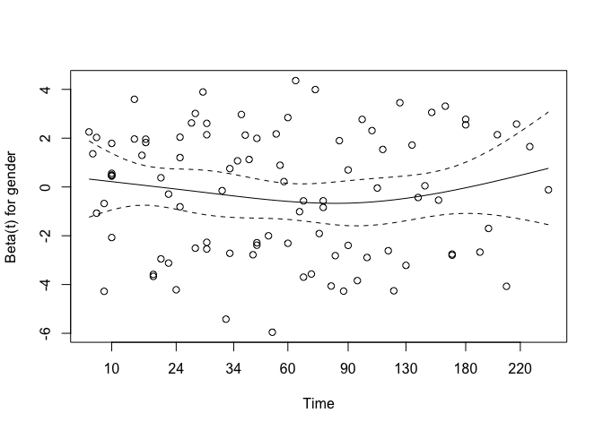<!-- -->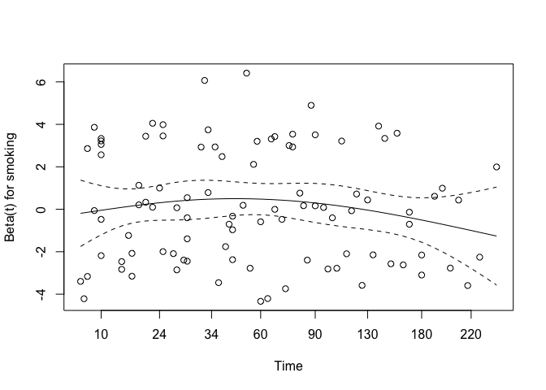<!-- -->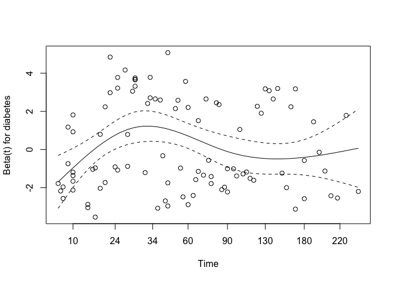<!-- --><!-- -->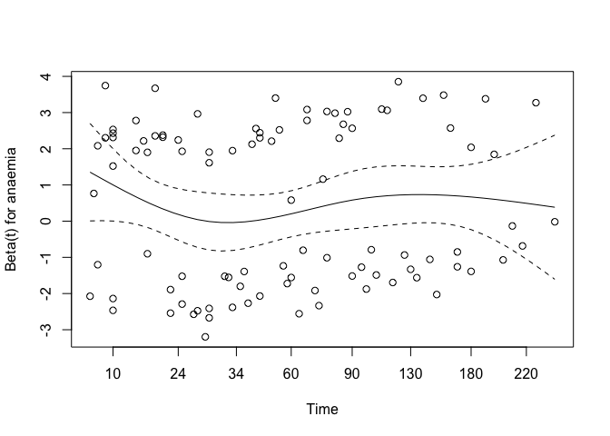<!-- -->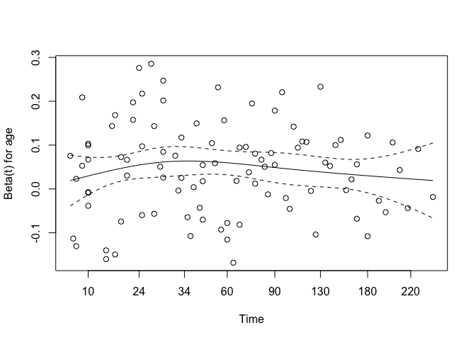<!-- -->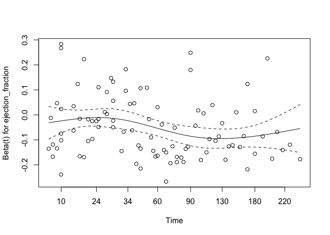<!-- -->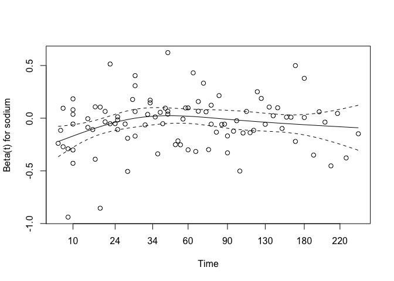<!-- -->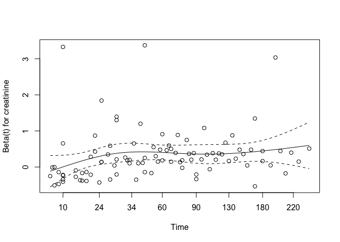<!-- -->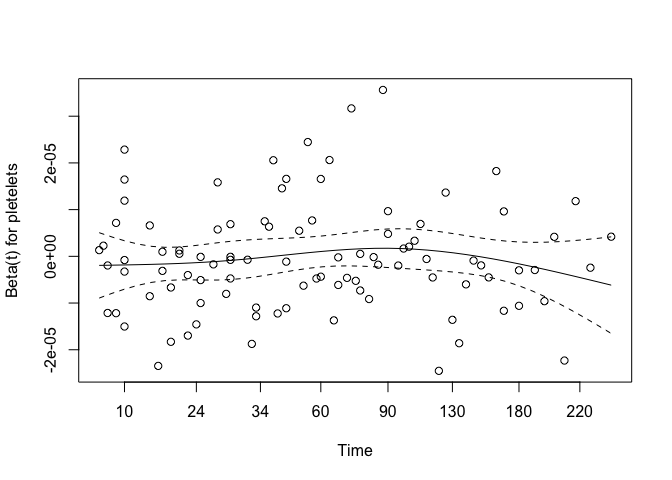<!-- -->

``` r
# Plot survival curves
ggsurvplot(survfit(cox_model), data = data, conf.int = TRUE)
```

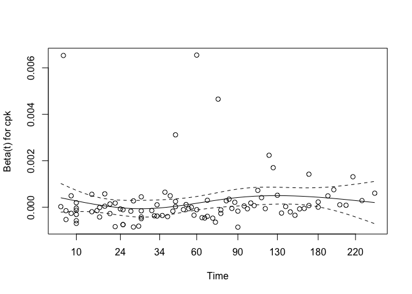<!-- -->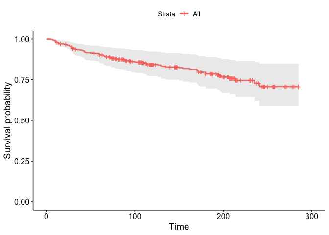<!-- -->
