P8108 Survival Analysis Heart Failure
================
Yi Huang
2023-11-10

## Load data

``` r
# read data
raw_data <- read_csv("data/heart_failure.csv")

# clean variable names
raw_data <- raw_data |>
  arrange(TIME) |>
  janitor::clean_names()

## data cleaning, create data frame for model
model_data <- raw_data |>
  mutate(gender = factor(gender),
         smoking = factor(smoking),
         diabetes = factor(diabetes),
         bp = factor(bp),
         # event = factor(event),
         anaemia = factor(anaemia),
         logcre=log(creatinine+1),
         logcpk = log(cpk+1)) |>
  rename(pletelets = pletelets)|>
  mutate(ef_cat = factor(case_when(
    ejection_fraction <= 30 ~ "Low",
    ejection_fraction > 30 & ejection_fraction < 45 ~ "Medium",
    ejection_fraction >= 45 ~ "High"),
    levels = c("Low", "Medium", "High")))

## create dummy variable for categorical variable
heart_data <- model.matrix(ejection_fraction~ef_cat, data = model_data)[,-1] |>
  as.data.frame()

## create data frame for stepwiseCox
heart_data <- cbind(raw_data, heart_data) 
stepwise_data <- heart_data |>
  mutate(logcre=log(creatinine+1),
         logcpk = log(cpk+1)) |>
  dplyr::select(-creatinine, -cpk, -ejection_fraction)
```

## Cox model

**Full model**

``` r
# use survival to fit a cox model
# 6 categorical and 5 continuous predictors
cox_model1 <- coxph(Surv(time, event) ~ gender + smoking + diabetes + bp + anaemia + age + ef_cat +
                     sodium + pletelets + creatinine + cpk, data = model_data)
summary(cox_model1)
```

    ## Call:
    ## coxph(formula = Surv(time, event) ~ gender + smoking + diabetes + 
    ##     bp + anaemia + age + ef_cat + sodium + pletelets + creatinine + 
    ##     cpk, data = model_data)
    ## 
    ##   n= 299, number of events= 96 
    ## 
    ##                    coef  exp(coef)   se(coef)      z Pr(>|z|)    
    ## gender1      -1.856e-01  8.306e-01  2.508e-01 -0.740 0.459413    
    ## smoking1      1.233e-01  1.131e+00  2.506e-01  0.492 0.622668    
    ## diabetes1     2.013e-01  1.223e+00  2.235e-01  0.901 0.367771    
    ## bp1           5.213e-01  1.684e+00  2.178e-01  2.394 0.016659 *  
    ## anaemia1      3.195e-01  1.376e+00  2.198e-01  1.454 0.145978    
    ## age           5.306e-02  1.054e+00  9.635e-03  5.507 3.65e-08 ***
    ## ef_catMedium -1.254e+00  2.855e-01  2.568e-01 -4.882 1.05e-06 ***
    ## ef_catHigh   -1.029e+00  3.574e-01  2.824e-01 -3.644 0.000269 ***
    ## sodium       -5.286e-02  9.485e-01  2.321e-02 -2.277 0.022770 *  
    ## pletelets    -7.680e-07  1.000e+00  1.110e-06 -0.692 0.489207    
    ## creatinine    2.495e-01  1.283e+00  7.040e-02  3.544 0.000395 ***
    ## cpk           2.628e-04  1.000e+00  9.775e-05  2.689 0.007170 ** 
    ## ---
    ## Signif. codes:  0 '***' 0.001 '**' 0.01 '*' 0.05 '.' 0.1 ' ' 1
    ## 
    ##              exp(coef) exp(-coef) lower .95 upper .95
    ## gender1         0.8306     1.2039    0.5080    1.3581
    ## smoking1        1.1312     0.8840    0.6922    1.8488
    ## diabetes1       1.2230     0.8176    0.7892    1.8954
    ## bp1             1.6843     0.5937    1.0992    2.5809
    ## anaemia1        1.3765     0.7265    0.8947    2.1175
    ## age             1.0545     0.9483    1.0348    1.0746
    ## ef_catMedium    0.2855     3.5029    0.1726    0.4722
    ## ef_catHigh      0.3574     2.7982    0.2055    0.6216
    ## sodium          0.9485     1.0543    0.9063    0.9927
    ## pletelets       1.0000     1.0000    1.0000    1.0000
    ## creatinine      1.2834     0.7792    1.1179    1.4732
    ## cpk             1.0003     0.9997    1.0001    1.0005
    ## 
    ## Concordance= 0.744  (se = 0.026 )
    ## Likelihood ratio test= 86.98  on 12 df,   p=2e-13
    ## Wald test            = 83.66  on 12 df,   p=8e-13
    ## Score (logrank) test = 92.66  on 12 df,   p=2e-14

**Full model with log transform on left-skewed predictors**

``` r
# use survival to fit a cox model
# consider transformation on left-skewed predictors: 
# logcre=log(creatinine+1), logcpk=log(cpk+1)
# 6 categorical and 5 continuous predictors 
cox_model2 <- coxph(Surv(time, event) ~ gender + smoking + diabetes + bp + anaemia + age + ef_cat+ sodium + pletelets + logcre + logcpk, data = model_data)
summary(cox_model2)
```

    ## Call:
    ## coxph(formula = Surv(time, event) ~ gender + smoking + diabetes + 
    ##     bp + anaemia + age + ef_cat + sodium + pletelets + logcre + 
    ##     logcpk, data = model_data)
    ## 
    ##   n= 299, number of events= 96 
    ## 
    ##                    coef  exp(coef)   se(coef)      z Pr(>|z|)    
    ## gender1      -1.816e-01  8.339e-01  2.497e-01 -0.727 0.466998    
    ## smoking1      1.561e-01  1.169e+00  2.537e-01  0.616 0.538209    
    ## diabetes1     2.106e-01  1.234e+00  2.240e-01  0.940 0.347097    
    ## bp1           5.125e-01  1.669e+00  2.158e-01  2.375 0.017549 *  
    ## anaemia1      2.909e-01  1.338e+00  2.156e-01  1.349 0.177311    
    ## age           4.902e-02  1.050e+00  9.697e-03  5.055 4.29e-07 ***
    ## ef_catMedium -1.125e+00  3.245e-01  2.563e-01 -4.390 1.13e-05 ***
    ## ef_catHigh   -9.488e-01  3.872e-01  2.793e-01 -3.396 0.000683 ***
    ## sodium       -4.136e-02  9.595e-01  2.356e-02 -1.755 0.079254 .  
    ## pletelets    -6.479e-07  1.000e+00  1.088e-06 -0.595 0.551584    
    ## logcre        1.158e+00  3.184e+00  2.994e-01  3.868 0.000110 ***
    ## logcpk        1.109e-01  1.117e+00  1.005e-01  1.104 0.269499    
    ## ---
    ## Signif. codes:  0 '***' 0.001 '**' 0.01 '*' 0.05 '.' 0.1 ' ' 1
    ## 
    ##              exp(coef) exp(-coef) lower .95 upper .95
    ## gender1         0.8339     1.1991    0.5112    1.3604
    ## smoking1        1.1690     0.8554    0.7110    1.9219
    ## diabetes1       1.2344     0.8101    0.7958    1.9149
    ## bp1             1.6694     0.5990    1.0937    2.5482
    ## anaemia1        1.3376     0.7476    0.8766    2.0411
    ## age             1.0502     0.9522    1.0305    1.0704
    ## ef_catMedium    0.3245     3.0814    0.1964    0.5363
    ## ef_catHigh      0.3872     2.5825    0.2240    0.6695
    ## sodium          0.9595     1.0422    0.9162    1.0048
    ## pletelets       1.0000     1.0000    1.0000    1.0000
    ## logcre          3.1839     0.3141    1.7706    5.7254
    ## logcpk          1.1173     0.8950    0.9176    1.3605
    ## 
    ## Concordance= 0.745  (se = 0.026 )
    ## Likelihood ratio test= 85.18  on 12 df,   p=4e-13
    ## Wald test            = 85.13  on 12 df,   p=4e-13
    ## Score (logrank) test = 91.9  on 12 df,   p=2e-14

## Variable Selection

**Selection Criteria SL**

7 variables are selected: logcre, age, ef_catMedium, ef_catHigh, bp,
sodium, anaemia .

``` r
# Variable selection using stepwise Cox model using Sl
stepwise_model1 <- stepwiseCox(Surv(time, event) ~ gender + smoking + diabetes + bp + 
                                 anaemia + age + sodium + pletelets + logcre + logcpk + 
                                 ef_catMedium + ef_catHigh,
                               data = stepwise_data,
                               select = "SL",
                               # significant level for entry
                               sle = 0.25,
                               # significant level for stay
                               sls = 0.15,
                               method = "efron",
                               weights = NULL,
                               best = NULL)

# stepwise_model1
# 7 variables are selected: logcre, age, ef_catMedium, ef_catHigh, bp, sodium, anaemia  
```

**Selection Criteria AIC**

6 variables are selected: logcre, age, ef_catMedium, ef_catHigh, bp,
sodium

``` r
## Variable selection using stepwise Cox model using AIC
stepwise_model2 <- stepwiseCox(Surv(time, event) ~ gender + smoking + diabetes + bp + 
                                 anaemia + age + sodium + pletelets + logcre + logcpk + 
                                 ef_catMedium + ef_catHigh,
                               data = stepwise_data,
                               selection = "bidirection",
                               select = "AIC",
                               # significant level for entry
                               sle = 0.25,
                               # significant level for stay
                               sls = 0.15,
                               method = "efron",
                               weights = NULL,
                               best = NULL)

stepwise_model2
```

    ##        Table 1. Summary of Parameters       
    ## ‗‗‗‗‗‗‗‗‗‗‗‗‗‗‗‗‗‗‗‗‗‗‗‗‗‗‗‗‗‗‗‗‗‗‗‗‗‗‗‗‗‗‗‗
    ##         Paramters               Value       
    ## ————————————————————————————————————————————
    ## Response Variable        Surv(time, event)   
    ## Included Variable        NULL                
    ## Selection Method         bidirection         
    ## Select Criterion         AIC                 
    ## Method                   efron               
    ## Multicollinearity Terms  NULL                
    ## ‗‗‗‗‗‗‗‗‗‗‗‗‗‗‗‗‗‗‗‗‗‗‗‗‗‗‗‗‗‗‗‗‗‗‗‗‗‗‗‗‗‗‗‗
    ## 
    ##                                          Table 2. Variables Type                                          
    ## ‗‗‗‗‗‗‗‗‗‗‗‗‗‗‗‗‗‗‗‗‗‗‗‗‗‗‗‗‗‗‗‗‗‗‗‗‗‗‗‗‗‗‗‗‗‗‗‗‗‗‗‗‗‗‗‗‗‗‗‗‗‗‗‗‗‗‗‗‗‗‗‗‗‗‗‗‗‗‗‗‗‗‗‗‗‗‗‗‗‗‗‗‗‗‗‗‗‗‗‗‗‗‗‗‗‗
    ##    class                                              variable                                            
    ## ——————————————————————————————————————————————————————————————————————————————————————————————————————————
    ## nmatrix.2  Surv(time, event)                                                                               
    ## numeric    gender smoking diabetes bp anaemia age sodium pletelets logcre logcpk ef_catMedium ef_catHigh   
    ## ‗‗‗‗‗‗‗‗‗‗‗‗‗‗‗‗‗‗‗‗‗‗‗‗‗‗‗‗‗‗‗‗‗‗‗‗‗‗‗‗‗‗‗‗‗‗‗‗‗‗‗‗‗‗‗‗‗‗‗‗‗‗‗‗‗‗‗‗‗‗‗‗‗‗‗‗‗‗‗‗‗‗‗‗‗‗‗‗‗‗‗‗‗‗‗‗‗‗‗‗‗‗‗‗‗‗
    ## 
    ##                    Table 3. Process of Selection                    
    ## ‗‗‗‗‗‗‗‗‗‗‗‗‗‗‗‗‗‗‗‗‗‗‗‗‗‗‗‗‗‗‗‗‗‗‗‗‗‗‗‗‗‗‗‗‗‗‗‗‗‗‗‗‗‗‗‗‗‗‗‗‗‗‗‗‗‗‗‗
    ##  Step  EnteredEffect  RemovedEffect  DF  NumberIn        AIC        
    ## ————————————————————————————————————————————————————————————————————
    ## 1     logcre                        1   1         993.048326864199   
    ## 2     age                           1   2         975.495411177225   
    ## 3     ef_catMedium                  1   3         965.994146660923   
    ## 4     ef_catHigh                    1   4         953.555445635325   
    ## 5     bp                            1   5         950.079987970209   
    ## 6     sodium                        1   6         949.633071741161   
    ## ‗‗‗‗‗‗‗‗‗‗‗‗‗‗‗‗‗‗‗‗‗‗‗‗‗‗‗‗‗‗‗‗‗‗‗‗‗‗‗‗‗‗‗‗‗‗‗‗‗‗‗‗‗‗‗‗‗‗‗‗‗‗‗‗‗‗‗‗
    ## 
    ##                        Table 4. Selected Varaibles                        
    ## ‗‗‗‗‗‗‗‗‗‗‗‗‗‗‗‗‗‗‗‗‗‗‗‗‗‗‗‗‗‗‗‗‗‗‗‗‗‗‗‗‗‗‗‗‗‗‗‗‗‗‗‗‗‗‗‗‗‗‗‗‗‗‗‗‗‗‗‗‗‗‗‗‗‗
    ##  variables1  variables2   variables3   variables4  variables5  variables6 
    ## ——————————————————————————————————————————————————————————————————————————
    ## logcre      age         ef_catMedium  ef_catHigh  bp          sodium       
    ## ‗‗‗‗‗‗‗‗‗‗‗‗‗‗‗‗‗‗‗‗‗‗‗‗‗‗‗‗‗‗‗‗‗‗‗‗‗‗‗‗‗‗‗‗‗‗‗‗‗‗‗‗‗‗‗‗‗‗‗‗‗‗‗‗‗‗‗‗‗‗‗‗‗‗
    ## 
    ##                                   Table 5. Coefficients of the Selected Variables                                  
    ## ‗‗‗‗‗‗‗‗‗‗‗‗‗‗‗‗‗‗‗‗‗‗‗‗‗‗‗‗‗‗‗‗‗‗‗‗‗‗‗‗‗‗‗‗‗‗‗‗‗‗‗‗‗‗‗‗‗‗‗‗‗‗‗‗‗‗‗‗‗‗‗‗‗‗‗‗‗‗‗‗‗‗‗‗‗‗‗‗‗‗‗‗‗‗‗‗‗‗‗‗‗‗‗‗‗‗‗‗‗‗‗‗‗‗‗
    ##    Variable           coef              exp(coef)           se(coef)               z                Pr(>|z|)       
    ## ———————————————————————————————————————————————————————————————————————————————————————————————————————————————————
    ## logcre        1.1050452084616      3.01936096638544   0.294774014823687   3.74878772514112   0.000177691402070054   
    ## age           0.046345944124046    1.04743670285961   0.0090830494759904  5.10246522894697   3.35257357927203e-07   
    ## ef_catMedium  -1.10818853131284    0.330156487850877  0.250250062440763   -4.42832469452494  9.49678618552646e-06   
    ## ef_catHigh    -0.958352769749456   0.383524118469508  0.277754807609556   -3.45035528996721  0.000559849223776396   
    ## bp            0.543520561583973    1.72205881691052   0.21386491114686    2.54141999577827   0.0110403209784974     
    ## sodium        -0.0383960625554244  0.962331721841969  0.0241249708289812  -1.59154855886082  0.111486176357268      
    ## ‗‗‗‗‗‗‗‗‗‗‗‗‗‗‗‗‗‗‗‗‗‗‗‗‗‗‗‗‗‗‗‗‗‗‗‗‗‗‗‗‗‗‗‗‗‗‗‗‗‗‗‗‗‗‗‗‗‗‗‗‗‗‗‗‗‗‗‗‗‗‗‗‗‗‗‗‗‗‗‗‗‗‗‗‗‗‗‗‗‗‗‗‗‗‗‗‗‗‗‗‗‗‗‗‗‗‗‗‗‗‗‗‗‗‗

``` r
# 6 variables are selected: logcre, age, ef_catMedium, ef_catHigh, bp, sodium
```

**Selection Criteria AICc**

9 variables are selected: logcre, age, ef_catMedium, ef_catHigh, bp,
sodium, anaemia, logcpk, diabetes

``` r
### Variable selection using stepwise Cox model using AICc
stepwise_model3 <- stepwiseCox(Surv(time, event) ~ gender + smoking + diabetes + bp + 
                                 anaemia + age + sodium + pletelets + logcre + logcpk + 
                                 ef_catMedium + ef_catHigh,
                               data = stepwise_data,
                               selection = "bidirection",
                               select = "AICc",
                               # significant level for entry
                               sle = 0.25,
                               # significant level for stay
                               sls = 0.15,
                               method = "efron",
                               weights = NULL,
                               best = NULL)

# stepwise_model3
# AICc 9 variables: logcre, age, ef_catMedium, ef_catHigh, bp, sodium, anaemia, logcpk, diabetes 
```

**Slection Criterian SBC**

5 variables are selected: logcre, age, ef_catMedium, ef_catHigh, bp

``` r
### Variable selection using stepwise Cox model using SBC
stepwise_model4 <- stepwiseCox(Surv(time, event) ~ gender + smoking + diabetes + bp + 
                                 anaemia + age + sodium + pletelets + logcre + logcpk + 
                                 ef_catMedium + ef_catHigh,
                               data = stepwise_data,
                               selection = "bidirection",
                               select = "SBC",
                               # significant level for entry
                               sle = 0.25,
                               # significant level for stay
                               sls = 0.15,
                               method = "efron",
                               weights = NULL,
                               best = NULL)

# stepwise_model4
# SBC 5 variables: logcre, age, ef_catMedium, ef_catHigh, bp
```

## Check assumptions for Cox model

**full model**

``` r
# Check assumptions with cox.zph
# full model
cox_zph <- cox.zph(cox_model2)
plot(cox_zph) # Residual plots
```

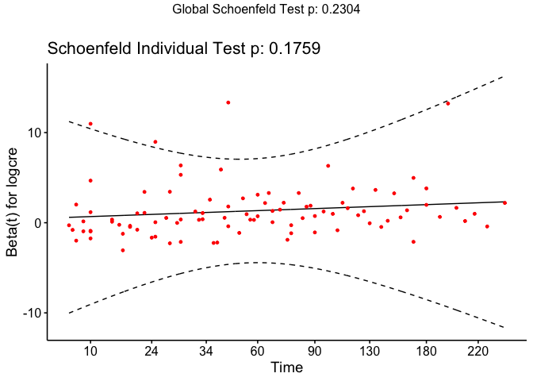<!-- -->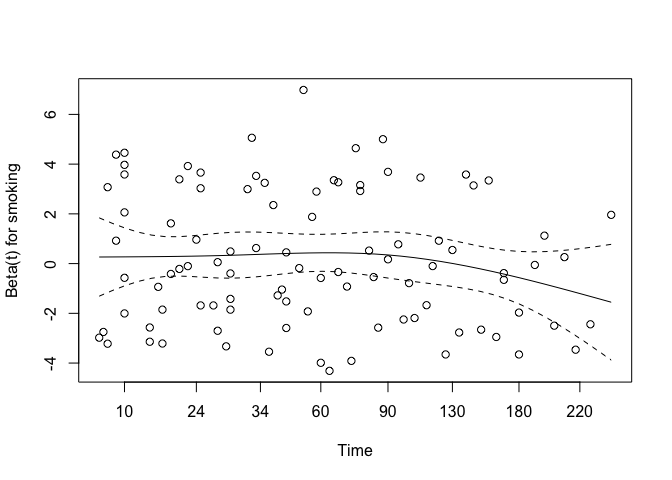<!-- -->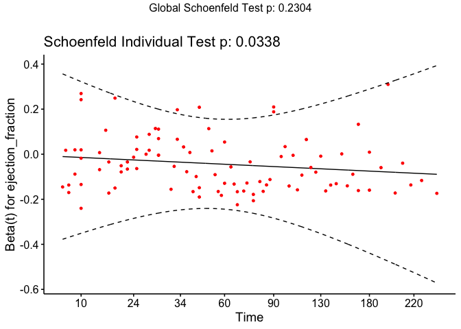<!-- -->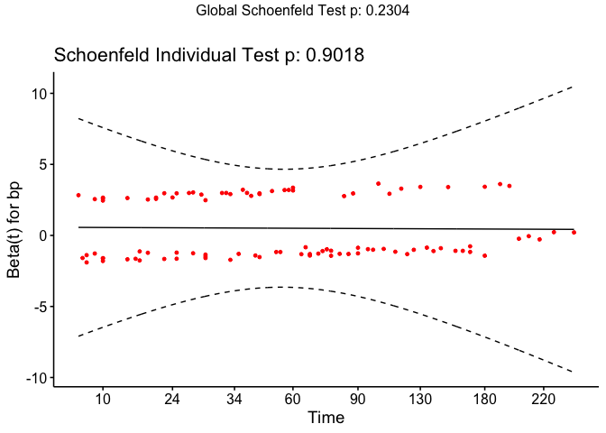<!-- -->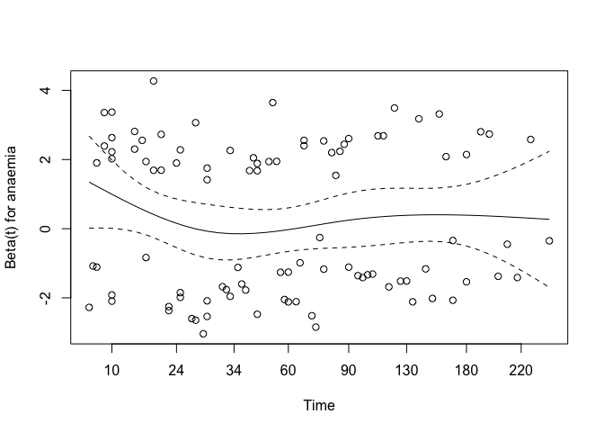<!-- -->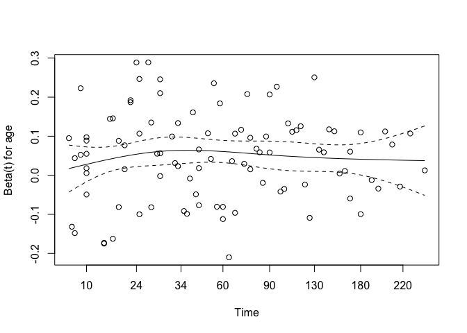<!-- --><!-- -->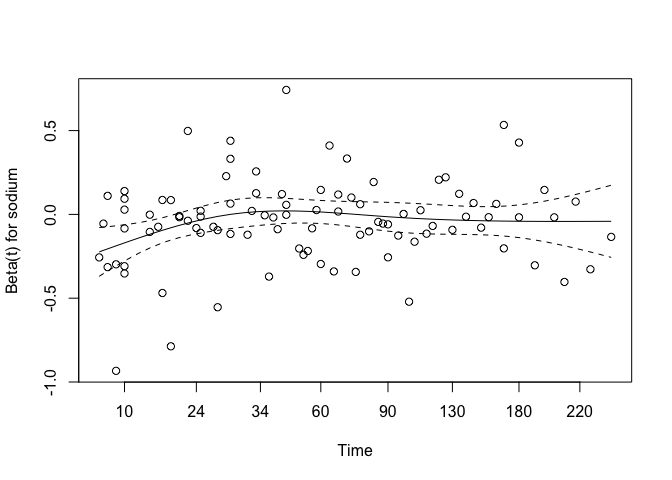<!-- --><!-- -->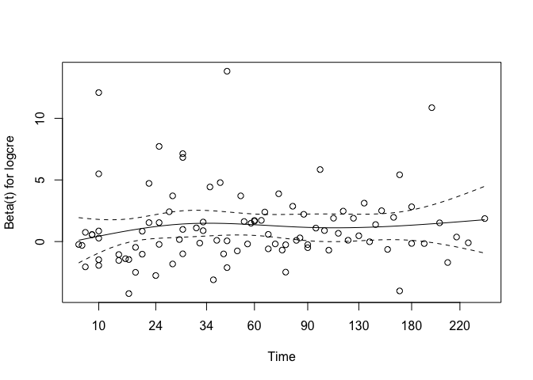<!-- -->

``` r
# Plot survival curves
ggsurvplot(survfit(cox_model2), data = model_data, conf.int = TRUE)
```

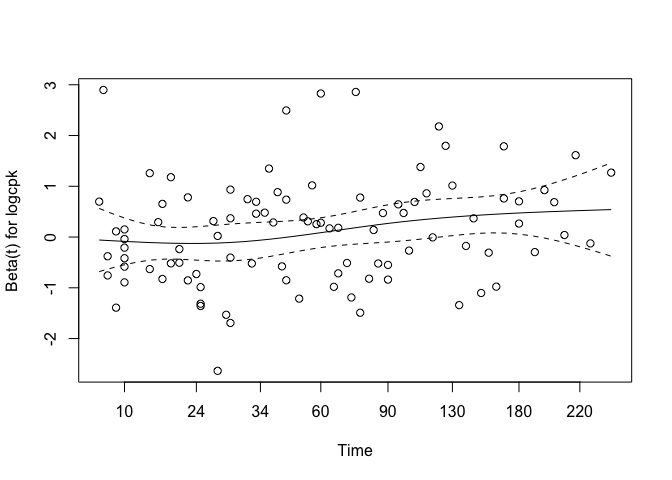<!-- -->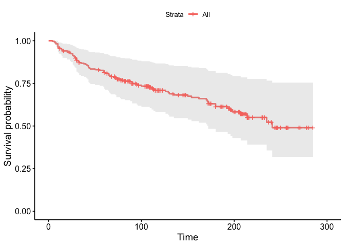<!-- -->

**Refit model with variables selected from stepwiseCox** log transform
on left-skewed predictors

logcre, age, ef_catMedium, ef_catHigh, bp, sodium

``` r
# refit a model with 5 selected variables using AIC
# logcre, age, efa_cat, bp, sodium
step_model <- coxph(Surv(time, event) ~ log(creatinine+1) + age + ef_cat + bp +
                      sodium, data = model_data)
summary(step_model)
```

    ## Call:
    ## coxph(formula = Surv(time, event) ~ log(creatinine + 1) + age + 
    ##     ef_cat + bp + sodium, data = model_data)
    ## 
    ##   n= 299, number of events= 96 
    ## 
    ##                          coef exp(coef)  se(coef)      z Pr(>|z|)    
    ## log(creatinine + 1)  1.105045  3.019361  0.294774  3.749 0.000178 ***
    ## age                  0.046346  1.047437  0.009083  5.102 3.35e-07 ***
    ## ef_catMedium        -1.108189  0.330156  0.250250 -4.428 9.50e-06 ***
    ## ef_catHigh          -0.958353  0.383524  0.277755 -3.450 0.000560 ***
    ## bp1                  0.543521  1.722059  0.213865  2.541 0.011040 *  
    ## sodium              -0.038396  0.962332  0.024125 -1.592 0.111486    
    ## ---
    ## Signif. codes:  0 '***' 0.001 '**' 0.01 '*' 0.05 '.' 0.1 ' ' 1
    ## 
    ##                     exp(coef) exp(-coef) lower .95 upper .95
    ## log(creatinine + 1)    3.0194     0.3312    1.6943    5.3806
    ## age                    1.0474     0.9547    1.0290    1.0663
    ## ef_catMedium           0.3302     3.0289    0.2022    0.5392
    ## ef_catHigh             0.3835     2.6074    0.2225    0.6610
    ## bp1                    1.7221     0.5807    1.1324    2.6187
    ## sodium                 0.9623     1.0391    0.9179    1.0089
    ## 
    ## Concordance= 0.737  (se = 0.026 )
    ## Likelihood ratio test= 80.78  on 6 df,   p=2e-15
    ## Wald test            = 81.55  on 6 df,   p=2e-15
    ## Score (logrank) test = 88.24  on 6 df,   p=<2e-16

``` r
# Check assumptions with model obtained from stepwiseCox
cox_step <- cox.zph(step_model)
plot(cox_step) # Residual plots
```

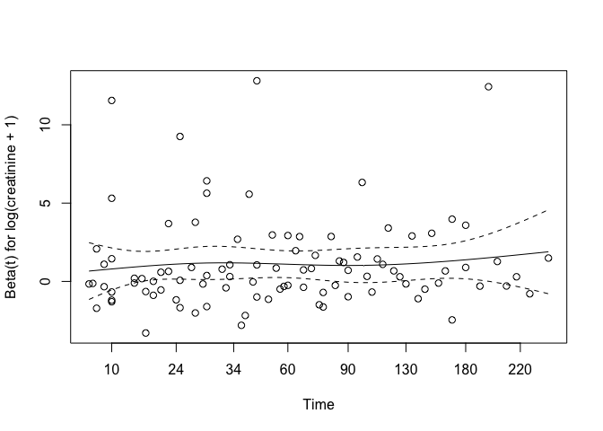<!-- -->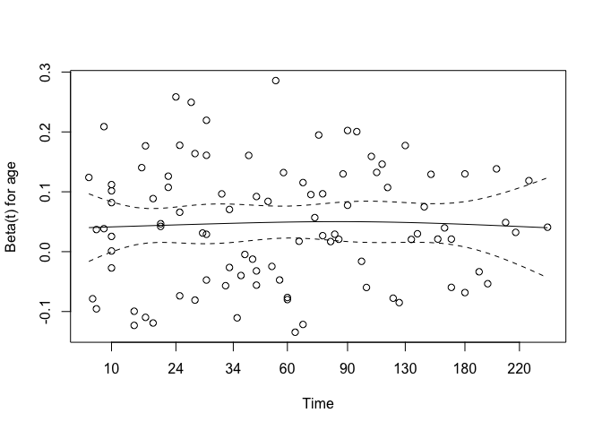<!-- -->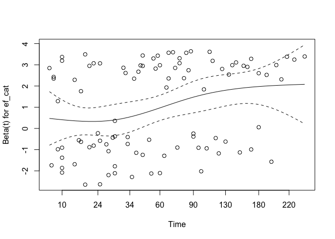<!-- -->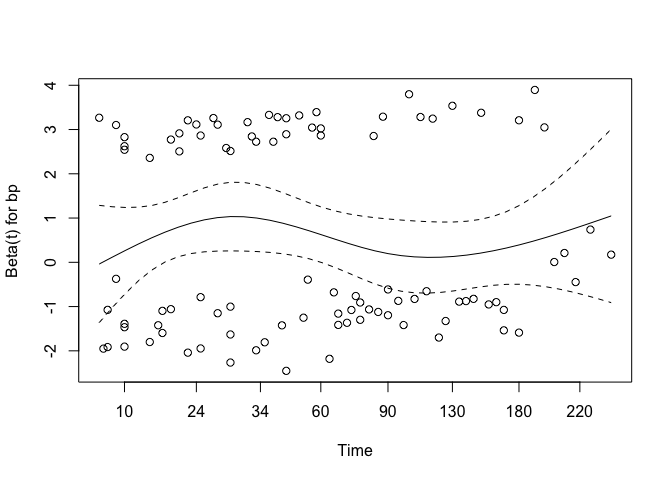<!-- -->

``` r
# Plot survival curves
ggsurvplot(survfit(step_model), data = model_data, conf.int = TRUE)
```

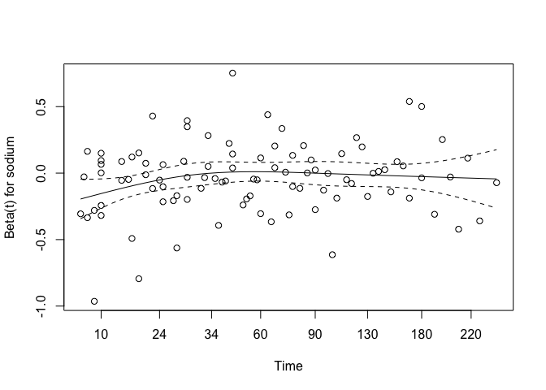<!-- -->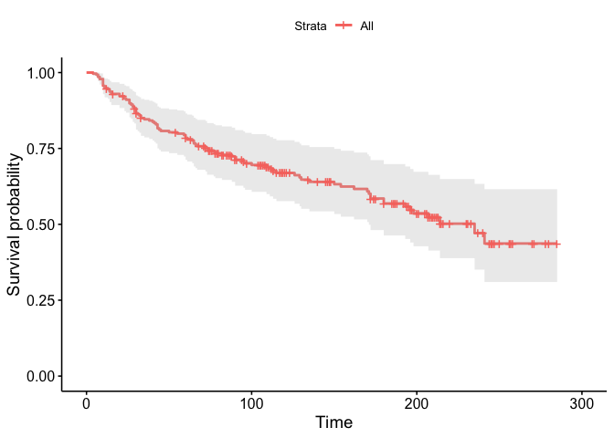<!-- -->

**Schoenfeld residuals**

``` r
colon_coxph <- coxph(Surv(time, event)~ logcre + age + ef_catMedium + ef_catHigh + 
                       bp + anaemia + sodium, data = stepwise_data)

ggcoxzph(cox.zph(colon_coxph), var = c("logcre"), df = 2, nsmo = 1000)
```

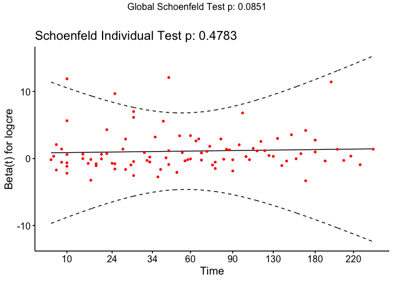<!-- -->

``` r
ggcoxzph(cox.zph(colon_coxph), var = c("age"), df = 2, nsmo = 1000)
```

<!-- -->

``` r
ggcoxzph(cox.zph(colon_coxph), var = c("ef_catMedium"), df = 2, nsmo = 1000)
```

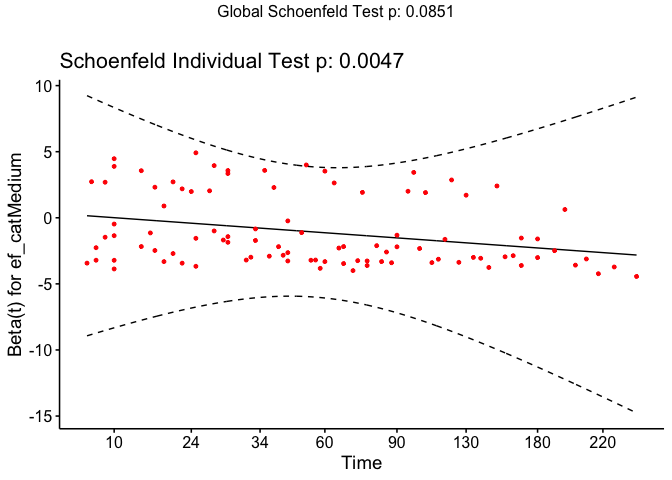<!-- -->

``` r
ggcoxzph(cox.zph(colon_coxph), var = c("ef_catHigh"), df = 2, nsmo = 1000)
```

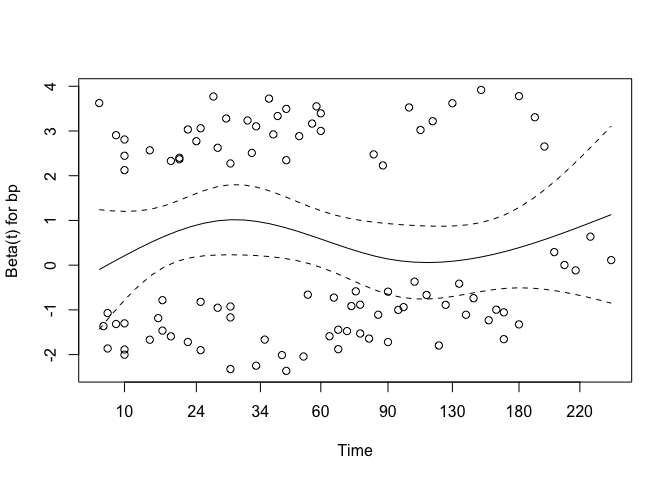<!-- -->

``` r
ggcoxzph(cox.zph(colon_coxph), var = c("bp"), df = 2, nsmo = 1000)
```

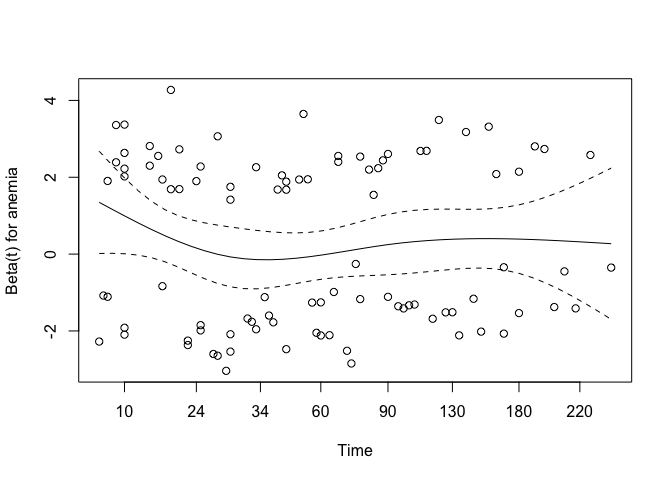<!-- -->

``` r
ggcoxzph(cox.zph(colon_coxph), var = c("anaemia"), df = 2, nsmo = 1000)
```

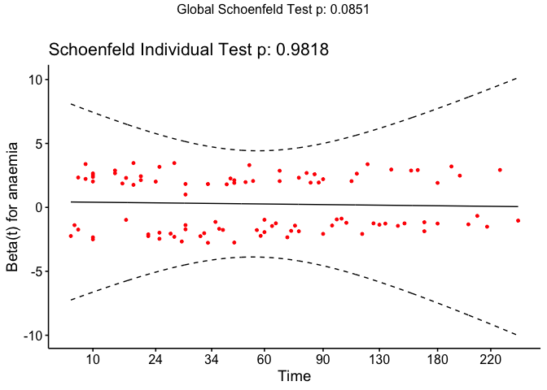<!-- -->

``` r
ggcoxzph(cox.zph(colon_coxph), var = c("sodium"), df = 2, nsmo = 1000)
```

<!-- -->
