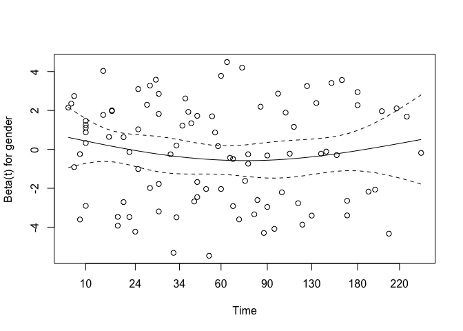
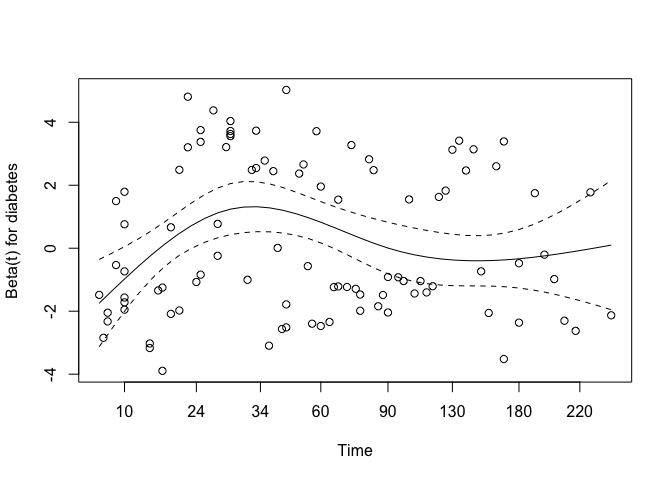

P8108 Survival Analysis Heart Failure
================
Yi Huang
2023-11-10

## Load data

``` r
# read data
raw_data <- read_csv("data/heart_failure.csv")

# clean variable names
raw_data <- raw_data |>
  arrange(TIME) |>
  janitor::clean_names() |>
  mutate(platelets = pletelets,
         anemia = anaemia)

## data cleaning, create data frame for model
model_data <- raw_data |>
  mutate(gender = factor(gender),
         smoking = factor(smoking),
         diabetes = factor(diabetes),
         bp = factor(bp),
         anemia = factor(anemia),
         logcre =log(creatinine+1),
         logcpk = log(cpk+1)) |>
  rename(platelets = platelets)|>
  mutate(ef_cat = factor(case_when(
    ejection_fraction <= 30 ~ "Low",
    ejection_fraction > 30 & ejection_fraction < 45 ~ "Medium",
    ejection_fraction >= 45 ~ "High"),
    levels = c("Low", "Medium", "High")))

## create dummy variable for categorical variable
heart_data <- model.matrix(ejection_fraction~ef_cat, data = model_data)[,-1] |>
  as.data.frame()

## create data frame for stepwiseCox
heart_data <- cbind(raw_data, heart_data) 
stepwise_data <- heart_data |>
  mutate(logcre=log(creatinine+1),
         logcpk = log(cpk+1)) |>
  dplyr::select(-creatinine, -cpk, -ejection_fraction)
```

## Cox model

**Full model**

``` r
# use survival to fit a cox model
# 6 categorical and 5 continuous predictors
cox_model1 <- coxph(Surv(time, event) ~ gender + smoking + diabetes + bp + anemia + age + ef_cat +
                     sodium + platelets + creatinine + cpk, data = model_data)
# summary(cox_model1)
```

**Full model with log transform on left-skewed predictors**

``` r
# use survival to fit a cox model
# consider transformation on left-skewed predictors: 
# logcre=log(creatinine+1), logcpk=log(cpk+1)
# 6 categorical and 5 continuous predictors 
cox_model2 <- coxph(Surv(time, event) ~ gender + smoking + diabetes + bp + anemia + age + ef_cat+ sodium + platelets + logcre + logcpk, data = model_data)
# summary(cox_model2)
```

## Variable Selection

**Selection Criteria SL**

7 variables are selected: logcre, age, ef_catMedium, ef_catHigh, bp,
sodium, anemia .

``` r
# Variable selection using stepwise Cox model using Sl
stepwise_model1 <- stepwiseCox(Surv(time, event) ~ gender + smoking + diabetes + bp + 
                                 anemia + age + sodium + platelets + logcre + logcpk + 
                                 ef_catMedium + ef_catHigh,
                               data = stepwise_data,
                               select = "SL",
                               # significant level for entry
                               sle = 0.25,
                               # significant level for stay
                               sls = 0.15,
                               method = "efron",
                               weights = NULL,
                               best = NULL)

# stepwise_model1
# 7 variables are selected: logcre, age, ef_catMedium, ef_catHigh, bp, sodium, anemia  
```

**Selection Criteria AIC**

6 variables are selected: logcre, age, ef_catMedium, ef_catHigh, bp,
sodium

``` r
## Variable selection using stepwise Cox model using AIC
stepwise_model2 <- stepwiseCox(Surv(time, event) ~ gender + smoking + diabetes + bp + 
                                 anemia + age + sodium + platelets + logcre + logcpk + 
                                 ef_catMedium + ef_catHigh,
                               data = stepwise_data,
                               selection = "bidirection",
                               select = "AIC",
                               # significant level for entry
                               sle = 0.25,
                               # significant level for stay
                               sls = 0.15,
                               method = "efron",
                               weights = NULL,
                               best = NULL)

# stepwise_model2
# 6 variables are selected: logcre, age, ef_catMedium, ef_catHigh, bp, sodium
```

**Selection Criteria AICc**

9 variables are selected: logcre, age, ef_catMedium, ef_catHigh, bp,
sodium, anemia, logcpk, diabetes

``` r
### Variable selection using stepwise Cox model using AICc
stepwise_model3 <- stepwiseCox(Surv(time, event) ~ gender + smoking + diabetes + bp + 
                                 anemia + age + sodium + platelets + logcre + logcpk + 
                                 ef_catMedium + ef_catHigh,
                               data = stepwise_data,
                               selection = "bidirection",
                               select = "AICc",
                               # significant level for entry
                               sle = 0.25,
                               # significant level for stay
                               sls = 0.15,
                               method = "efron",
                               weights = NULL,
                               best = NULL)

# stepwise_model3
# AICc 9 variables: logcre, age, ef_catMedium, ef_catHigh, bp, sodium, anemia, logcpk, diabetes 
```

**Slection Criterian SBC**

5 variables are selected: logcre, age, ef_catMedium, ef_catHigh, bp

``` r
### Variable selection using stepwise Cox model using SBC
stepwise_model4 <- stepwiseCox(Surv(time, event) ~ gender + smoking + diabetes + bp + 
                                 anemia + age + sodium + platelets + logcre + logcpk + 
                                 ef_catMedium + ef_catHigh,
                               data = stepwise_data,
                               selection = "bidirection",
                               select = "SBC",
                               # significant level for entry
                               sle = 0.25,
                               # significant level for stay
                               sls = 0.15,
                               method = "efron",
                               weights = NULL,
                               best = NULL)

# stepwise_model4
# SBC 5 variables: logcre, age, ef_catMedium, ef_catHigh, bp
```

# Table of Selection Summary

``` r
# Extract data from the models
steps2 <- stepwise_model3$`Process of Selection`[, "Step"]
enteredEffect1 <- stepwise_model3$`Process of Selection`[, "EnteredEffect"]
sl1 <- stepwise_model1$`Process of Selection`[, "SL"]
aic2 <- stepwise_model2$`Process of Selection`[, "AIC"]
aic3 <- stepwise_model3$`Process of Selection`[, "AICc"]
sbc4 <- stepwise_model4$`Process of Selection`[, "SBC"]

# Determine the maximum length
max_len <- max(sapply(list(steps2, enteredEffect1, sl1, aic2, aic3, sbc4), length))

# Function to pad vectors with NA to make their length equal to max_len
pad_vector <- function(vec, max_len) {
  length(vec) <- max_len
  return(vec)
}

# Apply the function to each vector
steps2 <- pad_vector(steps2, max_len)
enteredEffect1 <- pad_vector(enteredEffect1, max_len)
sl1 <- pad_vector(sl1, max_len)
aic2 <- pad_vector(aic2, max_len)
aic3 <- pad_vector(aic3, max_len)
sbc4 <- pad_vector(sbc4, max_len)

# Create the data frame
model_selection <- data.frame(
  Step = steps2,
  EnteredEffect = enteredEffect1,
  SL = round(as.numeric(sl1),4),
  AIC = round(as.numeric(aic2), 2),
  AICc = round(as.numeric(aic3), 2),
  SBC = round(as.numeric(sbc4), 2)
)
model_selection[is.na(model_selection)] <- c("-")
# Create table using kable
kable(model_selection, caption = "Summary of Model Selection", digits = 4) 
```

<table>
<caption>
Summary of Model Selection
</caption>
<thead>
<tr>
<th style="text-align:right;">
Step
</th>
<th style="text-align:left;">
EnteredEffect
</th>
<th style="text-align:left;">
SL
</th>
<th style="text-align:left;">
AIC
</th>
<th style="text-align:right;">
AICc
</th>
<th style="text-align:left;">
SBC
</th>
</tr>
</thead>
<tbody>
<tr>
<td style="text-align:right;">
1
</td>
<td style="text-align:left;">
logcre
</td>
<td style="text-align:left;">
0
</td>
<td style="text-align:left;">
993.05
</td>
<td style="text-align:right;">
991.09
</td>
<td style="text-align:left;">
995.61
</td>
</tr>
<tr>
<td style="text-align:right;">
2
</td>
<td style="text-align:left;">
age
</td>
<td style="text-align:left;">
0
</td>
<td style="text-align:left;">
975.5
</td>
<td style="text-align:right;">
971.62
</td>
<td style="text-align:left;">
980.62
</td>
</tr>
<tr>
<td style="text-align:right;">
3
</td>
<td style="text-align:left;">
ef_catMedium
</td>
<td style="text-align:left;">
7e-04
</td>
<td style="text-align:left;">
965.99
</td>
<td style="text-align:right;">
960.26
</td>
<td style="text-align:left;">
973.69
</td>
</tr>
<tr>
<td style="text-align:right;">
4
</td>
<td style="text-align:left;">
ef_catHigh
</td>
<td style="text-align:left;">
1e-04
</td>
<td style="text-align:left;">
953.56
</td>
<td style="text-align:right;">
946.00
</td>
<td style="text-align:left;">
963.81
</td>
</tr>
<tr>
<td style="text-align:right;">
5
</td>
<td style="text-align:left;">
bp
</td>
<td style="text-align:left;">
0.0193
</td>
<td style="text-align:left;">
950.08
</td>
<td style="text-align:right;">
940.75
</td>
<td style="text-align:left;">
962.9
</td>
</tr>
<tr>
<td style="text-align:right;">
6
</td>
<td style="text-align:left;">
sodium
</td>
<td style="text-align:left;">
0.1178
</td>
<td style="text-align:left;">
949.63
</td>
<td style="text-align:right;">
938.58
</td>
<td style="text-align:left;">

- </td>
  </tr>
  <tr>
  <td style="text-align:right;">
  7
  </td>
  <td style="text-align:left;">
  anemia
  </td>
  <td style="text-align:left;">
  0.1993
  </td>
  <td style="text-align:left;">

  - </td>
    <td style="text-align:right;">
    937.26
    </td>
    <td style="text-align:left;">

    - </td>
      </tr>
      <tr>
      <td style="text-align:right;">
      8
      </td>
      <td style="text-align:left;">
      logcpk
      </td>
      <td style="text-align:left;">

      - </td>
        <td style="text-align:left;">

        - </td>
          <td style="text-align:right;">
          936.60
          </td>
          <td style="text-align:left;">

          - </td>
            </tr>
            <tr>
            <td style="text-align:right;">
            9
            </td>
            <td style="text-align:left;">
            diabetes
            </td>
            <td style="text-align:left;">

            - </td>
              <td style="text-align:left;">

              - </td>
                <td style="text-align:right;">
                936.18
                </td>
                <td style="text-align:left;">

                - </td>
                  </tr>
                  </tbody>
                  </table>

``` r
# |>
# kable_styling(latex_options = c("striped", "hold_position"))
```

## Final Cox Model Results

``` r
# Create table using kable
model_summary <- tibble(stepwise_model2$`Coefficients of the Selected Variables`)

model_summary <- model_summary |>
  mutate(coef = as.numeric(coef),
        `exp(coef)` = as.numeric(`exp(coef)`),
        `se(coef)` = as.numeric(`se(coef)`),
        z = as.numeric(z),
        `Pr(>|z|)`= as.numeric(`Pr(>|z|)`))

kable(model_summary, 
      caption = "Summary of Cox Model", 
      digits = 4, row.names = TRUE)
```

<table>
<caption>
Summary of Cox Model
</caption>
<thead>
<tr>
<th style="text-align:left;">
</th>
<th style="text-align:left;">
Variable
</th>
<th style="text-align:right;">
coef
</th>
<th style="text-align:right;">
exp(coef)
</th>
<th style="text-align:right;">
se(coef)
</th>
<th style="text-align:right;">
z
</th>
<th style="text-align:right;">
Pr(\>\|z\|)
</th>
</tr>
</thead>
<tbody>
<tr>
<td style="text-align:left;">
1
</td>
<td style="text-align:left;">
logcre
</td>
<td style="text-align:right;">
1.1050
</td>
<td style="text-align:right;">
3.0194
</td>
<td style="text-align:right;">
0.2948
</td>
<td style="text-align:right;">
3.7488
</td>
<td style="text-align:right;">
0.0002
</td>
</tr>
<tr>
<td style="text-align:left;">
2
</td>
<td style="text-align:left;">
age
</td>
<td style="text-align:right;">
0.0463
</td>
<td style="text-align:right;">
1.0474
</td>
<td style="text-align:right;">
0.0091
</td>
<td style="text-align:right;">
5.1025
</td>
<td style="text-align:right;">
0.0000
</td>
</tr>
<tr>
<td style="text-align:left;">
3
</td>
<td style="text-align:left;">
ef_catMedium
</td>
<td style="text-align:right;">
-1.1082
</td>
<td style="text-align:right;">
0.3302
</td>
<td style="text-align:right;">
0.2503
</td>
<td style="text-align:right;">
-4.4283
</td>
<td style="text-align:right;">
0.0000
</td>
</tr>
<tr>
<td style="text-align:left;">
4
</td>
<td style="text-align:left;">
ef_catHigh
</td>
<td style="text-align:right;">
-0.9584
</td>
<td style="text-align:right;">
0.3835
</td>
<td style="text-align:right;">
0.2778
</td>
<td style="text-align:right;">
-3.4504
</td>
<td style="text-align:right;">
0.0006
</td>
</tr>
<tr>
<td style="text-align:left;">
5
</td>
<td style="text-align:left;">
bp
</td>
<td style="text-align:right;">
0.5435
</td>
<td style="text-align:right;">
1.7221
</td>
<td style="text-align:right;">
0.2139
</td>
<td style="text-align:right;">
2.5414
</td>
<td style="text-align:right;">
0.0110
</td>
</tr>
<tr>
<td style="text-align:left;">
6
</td>
<td style="text-align:left;">
sodium
</td>
<td style="text-align:right;">
-0.0384
</td>
<td style="text-align:right;">
0.9623
</td>
<td style="text-align:right;">
0.0241
</td>
<td style="text-align:right;">
-1.5915
</td>
<td style="text-align:right;">
0.1115
</td>
</tr>
</tbody>
</table>

``` r
# kable_styling(latex_options = c("striped", "hold_position"))
```

## Check assumptions for Cox model

**full model**

``` r
# Check assumptions with cox.zph
# full model
cox_zph <- cox.zph(cox_model2)
plot(cox_zph) # Residual plots
```

<!-- --><!-- --><!-- --><!-- --><!-- --><!-- --><!-- --><!-- --><!-- --><!-- -->

``` r
# Plot survival curves
ggsurvplot(survfit(cox_model2), data = model_data, conf.int = TRUE)
```

<!-- --><!-- -->

**Refit model with variables selected from stepwiseCox** log transform
on left-skewed predictors

logcre, age, ef_catMedium, ef_catHigh, bp, sodium

``` r
# refit a model with 5 selected variables using AIC
# logcre, age, efa_cat, bp, sodium
step_model <- coxph(Surv(time, event) ~ log(creatinine+1) + age + ef_cat + bp +
                      sodium, data = model_data)
summary(step_model)
```

    ## Call:
    ## coxph(formula = Surv(time, event) ~ log(creatinine + 1) + age + 
    ##     ef_cat + bp + sodium, data = model_data)
    ## 
    ##   n= 299, number of events= 96 
    ## 
    ##                          coef exp(coef)  se(coef)      z Pr(>|z|)    
    ## log(creatinine + 1)  1.105045  3.019361  0.294774  3.749 0.000178 ***
    ## age                  0.046346  1.047437  0.009083  5.102 3.35e-07 ***
    ## ef_catMedium        -1.108189  0.330156  0.250250 -4.428 9.50e-06 ***
    ## ef_catHigh          -0.958353  0.383524  0.277755 -3.450 0.000560 ***
    ## bp1                  0.543521  1.722059  0.213865  2.541 0.011040 *  
    ## sodium              -0.038396  0.962332  0.024125 -1.592 0.111486    
    ## ---
    ## Signif. codes:  0 '***' 0.001 '**' 0.01 '*' 0.05 '.' 0.1 ' ' 1
    ## 
    ##                     exp(coef) exp(-coef) lower .95 upper .95
    ## log(creatinine + 1)    3.0194     0.3312    1.6943    5.3806
    ## age                    1.0474     0.9547    1.0290    1.0663
    ## ef_catMedium           0.3302     3.0289    0.2022    0.5392
    ## ef_catHigh             0.3835     2.6074    0.2225    0.6610
    ## bp1                    1.7221     0.5807    1.1324    2.6187
    ## sodium                 0.9623     1.0391    0.9179    1.0089
    ## 
    ## Concordance= 0.737  (se = 0.026 )
    ## Likelihood ratio test= 80.78  on 6 df,   p=2e-15
    ## Wald test            = 81.55  on 6 df,   p=2e-15
    ## Score (logrank) test = 88.24  on 6 df,   p=<2e-16

``` r
# Check assumptions with model obtained from stepwiseCox
cox_step <- cox.zph(step_model)
plot(cox_step) # Residual plots
```

<!-- --><!-- --><!-- --><!-- -->

``` r
# Plot survival curves
ggsurvplot(survfit(step_model), data = model_data, conf.int = TRUE)
```

<!-- --><!-- -->

**Schoenfeld residuals**

``` r
colon_coxph <- coxph(Surv(time, event)~ logcre + age + ef_catMedium + ef_catHigh + 
                       bp + anemia + sodium, data = stepwise_data)

ggcoxzph(cox.zph(colon_coxph), var = c("logcre"), df = 2, nsmo = 1000)
```

<!-- -->

``` r
ggcoxzph(cox.zph(colon_coxph), var = c("age"), df = 2, nsmo = 1000)
```

<!-- -->

``` r
ggcoxzph(cox.zph(colon_coxph), var = c("ef_catMedium"), df = 2, nsmo = 1000)
```

<!-- -->

``` r
ggcoxzph(cox.zph(colon_coxph), var = c("ef_catHigh"), df = 2, nsmo = 1000)
```

<!-- -->

``` r
ggcoxzph(cox.zph(colon_coxph), var = c("bp"), df = 2, nsmo = 1000)
```

<!-- -->

``` r
ggcoxzph(cox.zph(colon_coxph), var = c("anemia"), df = 2, nsmo = 1000)
```

<!-- -->

``` r
ggcoxzph(cox.zph(colon_coxph), var = c("sodium"), df = 2, nsmo = 1000)
```

<!-- -->
